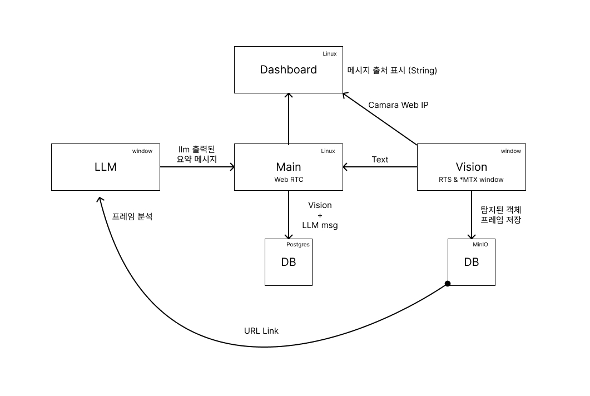

# LLM 기반 CCTV 관제 시스템

카메라 영상에서 사람을 탐지하고, 탐지 프레임을 LLM으로 요약해 대시보드에 표시하는 CCTV 관제 시스템입니다. 실시간 영상 스트림과 이벤트 처리 파이프라인을 분리해, 영상 재생과 탐지/요약 저장이 서로 독립적으로 동작하도록 구성했습니다.

---

## 1. 프로젝트 개요

이 프로젝트는 Vision Server가 카메라 영상에서 사람을 탐지하고, LLM Server가 탐지 프레임을 분석해 한 문장 요약을 생성하며, Main Server와 Dashboard가 이벤트·이미지·요약을 조회 가능한 형태로 보여주는 구조입니다.

주요 목표:

- 실시간 카메라 영상 재생
- 객체 탐지 이벤트 저장
- 탐지 프레임 이미지 저장
- LLM 기반 상황 요약
- Dashboard에서 영상, 탐지 이벤트, 이미지, 요약 통합 표시

---

## 2. 구성도



---

## 3. 시스템 구성

| 구성 요소 | 실행 위치 | 역할 | 문서 |
|-----------|-----------|------|------|
| vision-server | Windows Vision PC | 카메라 입력, YOLO 탐지, MinIO 업로드, NATS 발행, MediaMTX 스트림 푸시 | [vision-server/README.md](vision-server/README.md) |
| llm-server | Windows LLM PC | Vision 이벤트 구독, MinIO 프레임 fetch, LLaVA 요약, NATS 발행 | [llm-server/README.md](llm-server/README.md) |
| main-server | Linux PC | NATS 이벤트 수신, PostgreSQL 저장, Dashboard용 REST API 제공 | [main-server/README.md](main-server/README.md) |
| dashboard | Linux PC | 실시간 영상, 탐지 이벤트, 이미지, LLM 요약 표시 | [dashboard/README.md](dashboard/README.md) |
| infra | VM | PostgreSQL, MinIO, NATS JetStream | [docs/infra-setup.md](docs/infra-setup.md) |

기술 스택:


---

## 4. End-to-end 워크플로우

```text
카메라
  │
  ▼
vision-server
  ├─ YOLO person detection
  ├─ MinIO upload: events/<event_id>/thumb.jpg
  ├─ NATS publish: cs.vision.control.detected
  └─ MediaMTX stream: cam01 / cam01_ai

llm-server
  ├─ NATS subscribe: cs.vision.control.detected
  ├─ MinIO fetch: data.image_key
  ├─ LLaVA image summary
  └─ NATS publish: cs.llm.control.update

main-server
  ├─ Vision event 저장
  ├─ LLM analysis 저장
  └─ REST API: /events, /events/{event_id}

dashboard
  ├─ MediaMTX WebRTC 영상 표시
  ├─ NATS live event 병합
  ├─ main-server /events 초기 로드
  └─ MinIO image proxy로 thumb.jpg 표시
```

탐지 이벤트와 LLM 요약은 같은 `event_id`를 공유합니다. Dashboard는 Vision 메시지로 카드를 먼저 만들고, LLM 메시지가 나중에 도착하면 같은 카드에 요약을 채웁니다.

---

## 5. 실행 순서 요약

자세한 설정은 각 서버 README와 [docs/infra-setup.md](docs/infra-setup.md)를 따릅니다.

1. VM에서 PostgreSQL, MinIO, NATS 실행
2. Linux PC에서 SSH 터널 준비
3. Linux PC에서 main-server + dashboard 실행

   ```bash
   ./scripts/main_start.sh
   ```

4. Windows LLM PC에서 llm-server 실행

   ```powershell
   cd llm-server
   .\llm_start.ps1
   ```

5. Windows Vision PC에서 vision-server 실행

   ```powershell
   cd vision-server
   .\vision_start.ps1
   ```

6. Dashboard 접속

   ```text
   http://127.0.0.1:5001
   ```

Vision Server가 출력하는 `MEDIA_URL`을 Dashboard에 입력하면 실시간 영상을 볼 수 있습니다.

---

## 6. 레포 구조

```text
capstone-ii/
├── dashboard/          # Flask dashboard
├── docs/               # 공용 계약/인프라 문서
├── infra/              # PostgreSQL 초기화 스크립트와 로컬 데이터 디렉터리
├── llm-server/         # LLaVA/Ollama 기반 이미지 요약 서버
├── main-server/        # FastAPI + PostgreSQL + NATS consumer
├── scripts/            # Linux PC 실행/종료 스크립트
├── vision-server/      # YOLO 탐지 + MinIO/NATS/MediaMTX 연동 서버
└── docker-compose.yml  # VM 인프라 스택 정의
```

---

## 7. 문서

| 문서 | 내용 |
|------|------|
| [docs/infra-setup.md](docs/infra-setup.md) | VM, SSH 터널, 포트, bucket, camera row 등 공통 인프라 셋업 |
| [docs/nats-schema.md](docs/nats-schema.md) | Vision/LLM NATS 메시지 계약 |
| [docs/db-schema.md](docs/db-schema.md) | PostgreSQL 스키마 |
| [vision-server/README.md](vision-server/README.md) | Vision Server 실행/운영 |
| [llm-server/README.md](llm-server/README.md) | LLM Server 실행/운영 |
| [main-server/README.md](main-server/README.md) | Main Server 실행/운영 |
| [dashboard/README.md](dashboard/README.md) | Dashboard 실행/운영 |

---

## 8. 구성원

| Name | Position | Git |
|------|----------|-----|
| 이민기 | PM, Main Server 개발 | https://github.com/mk8048 |
| 김가영 | LLM Server 개발 | |
| 이병철 | Vision Server 개발 | |
| 이하늘 | Dashboard 개발 | |
